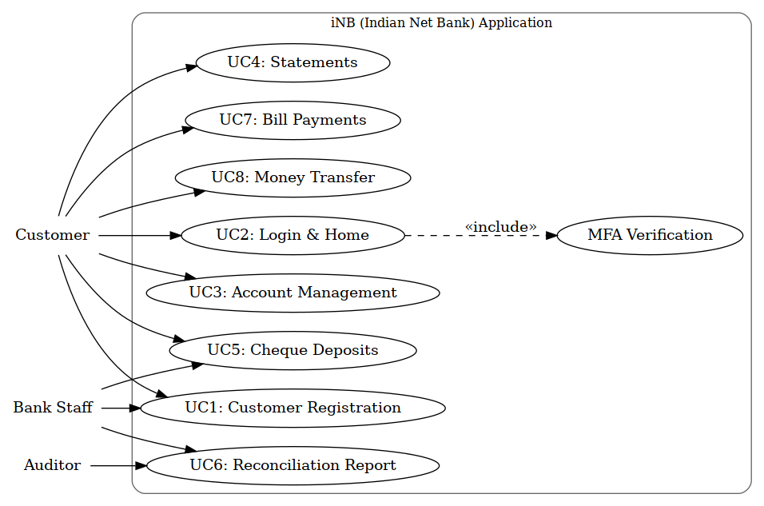
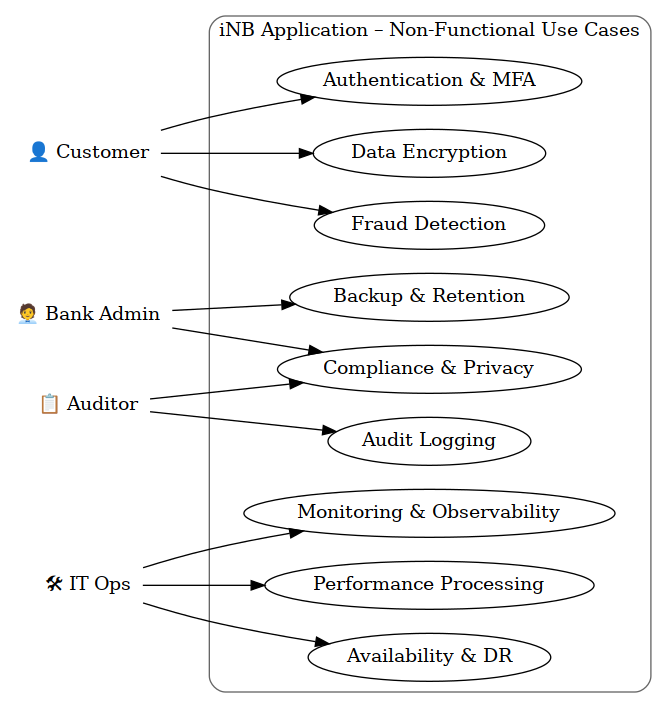
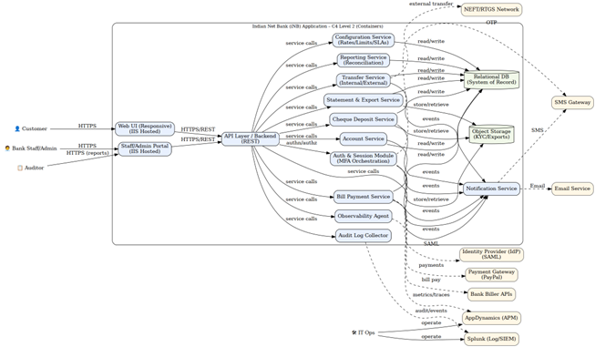
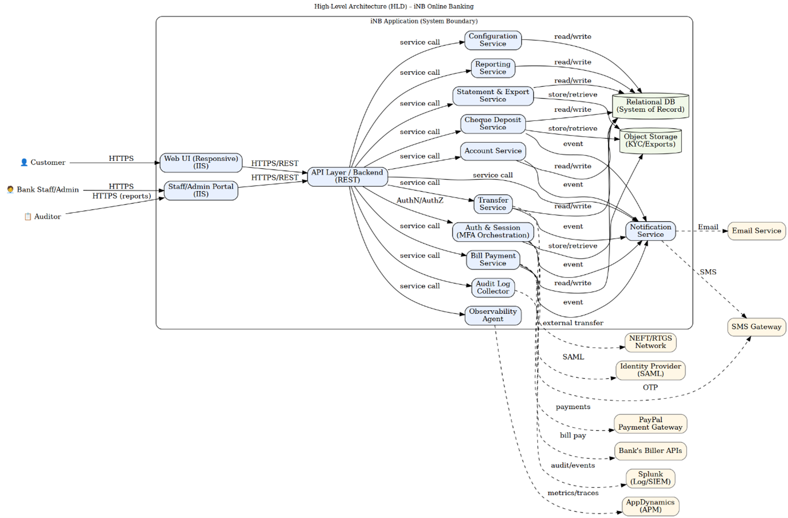
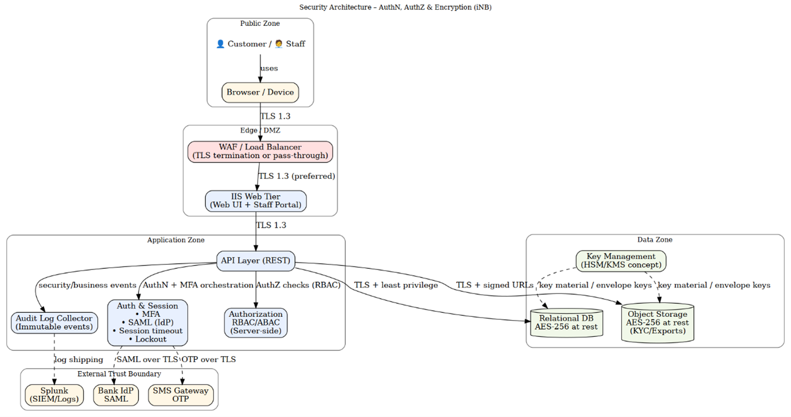
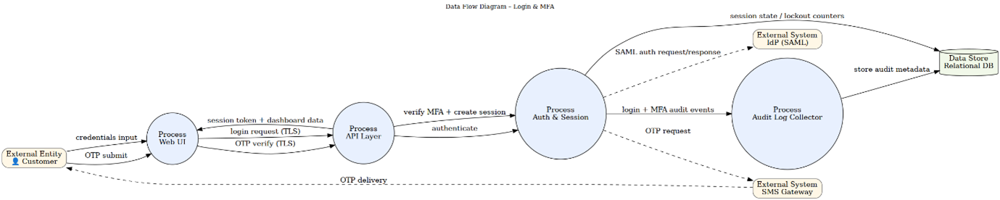
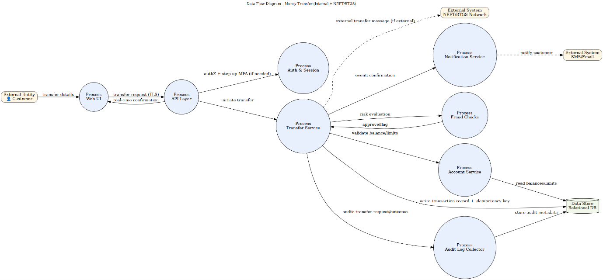
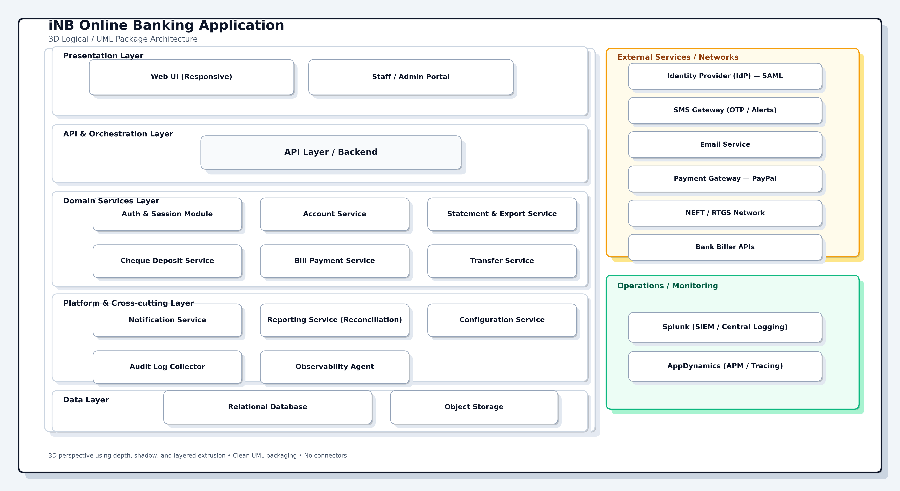

 
   
   ## 1. Requirement Analysis 

   
### 1.1 Functional & Non-Functional

[iBank_RequirementAnalysisClarafication_v1.md](iBank_RequirementAnalysisClarafication_v1.md)

### 1.2 Use-case Diagram
#### 1.2.1 Functional
   
#### 1.2.2 Non-Functional
   

 

  ##     Requirement Traceability Matrix - STRIDE Thread-to-Control Mapping
 
   
 
 [RTM_with_STRIDE_Threat_Control_Mapping_iNB.md](RTM_with_STRIDE_Threat_Control_Mapping_iNB.md)

 

 ## Architectural Guardrails
 
   

 [Architectural Guardrails – iNB.md](<Architectural Guardrails – iNB.md>)

   

   ## C4 System Context, Container
   

   [System_Context_with_L2_Diagram_iNB.md](System_Context_with_L2_Diagram_iNB.md)

   ## System Context Diagram
   
   

   

   ## High Level Architecture
   

   [HLD_Diagrams_DataFlows_SecurityArchitecture_iNB.md](HLD_Diagrams_DataFlows_SecurityArchitecture_iNB.md)
   ## Component Diagram 
   

   ## Security Architecture
   

   ## Data Flow Diagram - Login & MFA
   

   ## Data Flow Diagram - Money Transfer
   

   

   ## Logical Architecture
   

  

   

   ### Data Architecture - Conceptual & Logical Data Architecture
   

   [Conceptual & Logical Data Model-iNB.md](<Conceptual & Logical Data Model-iNB.md>)
   
   ##   Conceptual Data Model (Domain View)
   

   ##   Logical ER – Core Banking & Payments
   

   ##   Logical ER – Security, Audit & Configuration
   

   ##    Data Dictionary model
   

   

   ## Deployment Model
   

   [Deployment Model Architecture-iNB.md](<Deployment Model Architecture-iNB.md>)

   ## Network Segmentation Diagram (Zones & Firewalls)
   

   ## UML Deployment View (Production – with Firewalls)
   

   ## UML Deployment Diagram – Production vs DR (Side‑by‑Side)
   

   ## Backup and Restore Flow (UML Activity)
   

   ## UML Deployment Diagram – Production
   
   

 

   ## Architectural Styles
 

   ## Architectural Style Specifications
   [Architectural Style Specification-iNB.md](<Architectural Style Specification-iNB.md>)

   ## ADR - Architectural Style
   [ADR_iNB_Architectural_Styles.md](<ADR_iNB_Architectural_Styles.md>)

   

   ## Full Architectural Decision Record
   

   [iNB_ADR_Artifact_Full_v1.0.md](iNB_ADR_Artifact_Full_v1.0.md)

