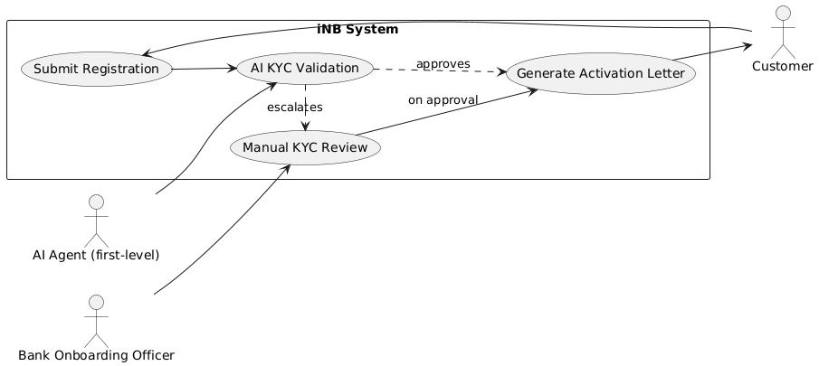
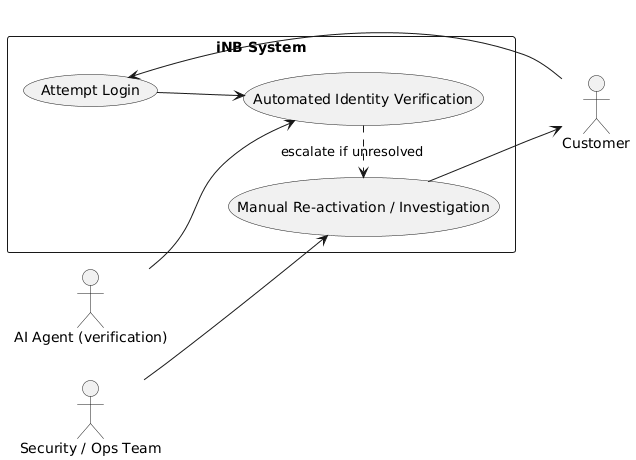
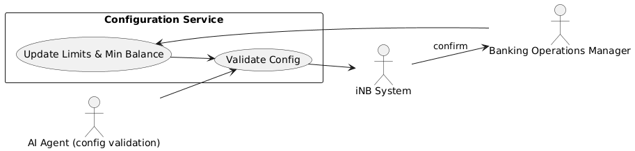
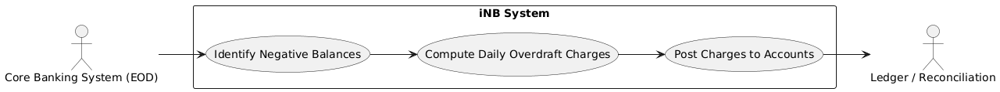
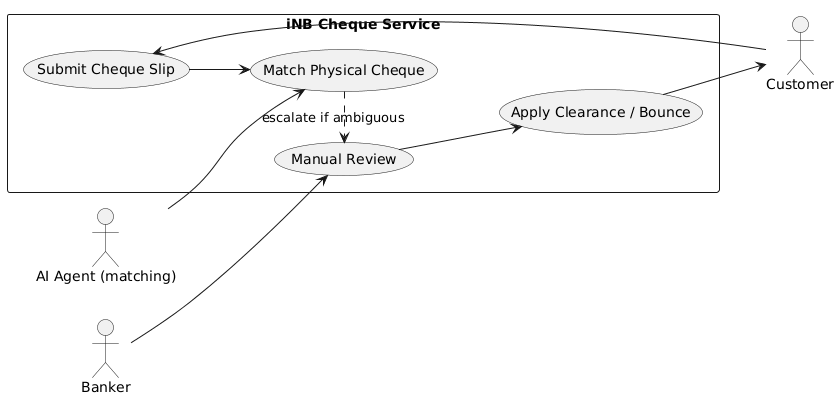
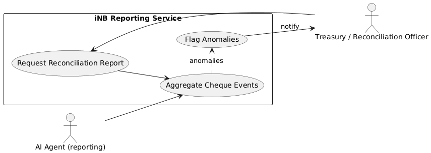
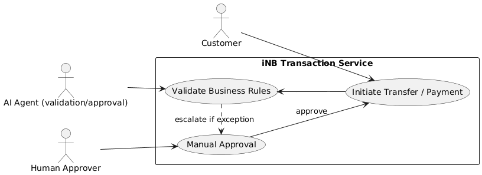
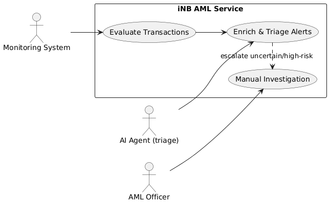
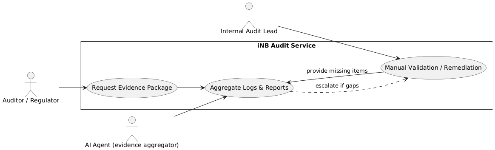

# Use Cases — Security, Governance & Compliance

This file captures concise use cases that satisfy the security, governance and compliance requirements extracted from `requirements.md`.

---

Use Case ID: UC-REG-01
### Customer Registration & KYC Approval
Primary Actor: AI Agent (first-level)
Secondary Actor: Bank Onboarding Officer (escalation)
Description: Customer submits registration; an AI agent performs first-level KYC and document validation and will auto-approve when confidence and rule checks pass; unresolved or exceptional cases escalate to a human onboarding officer who performs manual review and issues activation letter.
Preconditions: Customer completes online registration form; required documents uploaded; AI Agent model and rule-set available.
Basic Flow:
1. Customer submits registration with required details and documents.
2. System creates a pending registration record and invokes the AI Agent.
3. AI Agent performs automated KYC checks (document verification, data matching, sanctions screening) and records confidence score and evidence.
4. 4a. If AI Agent approves with sufficient confidence and all rules pass, system auto-generates activation letter and activates the account. 4b. If AI Agent cannot validate or finds exceptions, it escalates the case to the Bank Onboarding Officer with pre-populated findings.
5. Onboarding Officer completes manual review if required and marks registration approved or rejected; system records decision.
Alternate Flow: If KYC fails at human review, registration is rejected and customer notified with remediation steps.
Postconditions: Account created and activation recorded; AI decision, evidence and any human overrides are logged for audit.

---

Use Case ID: UC-AUTH-01
### User Login and Account Lockout
Primary Actor: Customer
Description: Customer authenticates; system enforces lockout after three failed attempts. An AI Agent provides the first-level identity validation and remediation (self-service verification) and will only escalate to operations/security if verification fails or risk is high.
Preconditions: Customer has an active account and credentials; AI Agent has access to verification channels (OTP, biometric, challenge questions).
Basic Flow:
1. Customer enters credentials and attempts login.
2. On successful authentication, system grants access and resets failed-attempt counter.
3. On failed authentication, system increments failed-attempt counter.
4. When failed-attempt counter reaches 3, system locks the account and triggers the AI Agent to perform automated identity verification (e.g., OTP, knowledge-based checks, device risk analysis).
4a. If AI Agent verifies identity and risk is low, it performs a controlled unlock and records the action.
4b. If AI Agent cannot verify identity or flags high risk, it escalates to the security/ops team for manual re-activation and investigation.
Alternate Flow: Locked accounts unresolved by AI Agent remain locked until manual re-activation; all actions are recorded.
Postconditions: Successful logins, AI interventions, and lock/unlock events are logged and retained for audit.

---

Use Case ID: UC-ACC-01
### Configure and Enforce Transaction Limits
Primary Actor: Banking Operations Manager
Description: Configure daily withdrawal limits and minimum balance values; system enforces them at transaction time.
Preconditions: Manager has appropriate admin privileges.
Basic Flow:
1. Manager updates configuration for daily withdrawal limit and minimum-balance requirement.
2. System validates and persists the configuration.
3. During withdrawal, system enforces current configured limits and rejects transactions that violate rules.
Postconditions: Config changes are auditable; transactions conform to configured limits.

---

Use Case ID: UC-OD-01
### Overdraft Processing and Daily Charge Calculation
Primary Actor: Core Banking System (automated process)
Description: System applies overdraft when permitted and calculates daily overdraft charges.
Preconditions: Customer has overdraft facility enabled on account.
Basic Flow:
1. During end-of-day processing, system identifies accounts with negative balances.
2. System computes daily overdraft charges using the configured rate and posts charges to accounts.
3. Transaction and charge records are logged for reconciliation and audit.
Postconditions: Overdraft charges applied and traceable in ledger and reports.

---

Use Case ID: UC-CHE-01
### Cheque Deposit Submission and Clearance Workflow
Primary Actor: AI Agent (first-level)
Secondary Actor: Banker (Operations)
Description: Customer submits online cheque slips; an AI Agent performs first-level matching of online slips to received physical cheques (using courier/scan confirmation, OCR, or image matching) and advances statuses when matches are confident; exceptions and ambiguous cases are routed to a banker for manual processing.
Preconditions: Customer has submitted online cheque slip and mailed physical cheque; AI Agent has access to courier/scan inputs and OCR capabilities.
Basic Flow:
1. Customer submits cheque details via online slip and sends physical cheque.
2. System enqueues the slip and invokes AI Agent to match incoming physical cheque receipts (courier/tracking updates or scanned images) to online slips.
3a. If AI Agent finds a confident match, it marks status to 'Received' and later 'Sent for Clearance' automatically as processing progresses.
3b. If AI Agent cannot confidently match or detects anomalies (e.g., mismatched amount, poor image quality), it creates a task and escalates to the Banker for manual review.
4. If cheque clears, account is credited; if bounced, fine is applied and status updated (AI can suggest bounce reason and remediation steps).
Postconditions: Cheque lifecycle events, AI actions and banker interventions are recorded and auditable.

---

Use Case ID: UC-REC-01
### Reconciliation Report Generation
Primary Actor: AI Agent (first-level)
Secondary Actor: Treasury / Reconciliation Officer
Description: An AI Agent automatically aggregates cheque processing events and generates reconciliation reports on-demand or on schedule; human officers review only when anomalies or exceptions are reported.
Preconditions: Cheque processing events have been recorded and AI has access to event store.
Basic Flow:
1. Officer requests reconciliation report for a date or range or the AI Agent auto-triggers scheduled reports.
2. AI Agent aggregates cheque statuses, applies business rules and generates the report, flagging any anomalies.
3a. If no anomalies, AI stores the report and evidence artifacts for audit retention.
3b. If anomalies are detected, AI notifies the Treasury Officer with pre-populated findings for validation and remediation.
Postconditions: Report available for review; AI flags and human remediation actions are logged and retained per retention policy.

---

Use Case ID: UC-TRX-01
### Funds Transfer and Bill Payment Auditable Processing
Primary Actor: Customer
Description: Customer initiates internal transfers or bill payments; the system ensures transactions are auditable and retains required evidence. For exception handling or approval-required transactions, an AI Agent performs first-level validation and may auto-approve routine cases; only exceptional or high-risk transactions escalate to human approvers.
Preconditions: Customer authenticated and has sufficient balance or overdraft permissions; AI validation rules configured for approvals/exceptions.
Basic Flow:
1. Customer initiates transfer or bill payment (immediate or scheduled).
2. System validates business rules (limits, balances, schedules) and invokes AI Agent for any required validation or approval logic.
2a. If AI Agent validates and auto-approves, transaction proceeds and metadata is recorded for audit.
2b. If AI Agent flags an exception or high-risk pattern, it creates an approval task for the human approver with pre-populated evidence.
3. For scheduled payments, system executes at scheduled time and retains audit trail.
Postconditions: Transaction records are stored with sufficient detail to support compliance and investigations; AI decisions and escalations are logged.

---

Use Case ID: UC-AML-01
### Transaction Monitoring and AML Alerting
Primary Actor: AI Agent (monitoring/triage)
Secondary Actor: AML Officer
Description: The monitoring system and AI Agent evaluate transactions for AML/KYC anomalies and perform automated triage and enrichment of alerts; the AML Officer reviews only those alerts that the AI cannot conclusively disposition.
Preconditions: Monitoring rules and thresholds configured; transaction streams available; AI enrichment models available.
Basic Flow:
1. Monitoring system evaluates transactions against AML rules and invokes AI Agent for triage.
2. AI Agent enriches alerts with contextual evidence, risk scoring and suggested dispositions.
3a. If AI Agent indicates a clear disposition or low-risk false positive, it auto-closes or marks for monitoring and records the rationale.
3b. If AI Agent flags high-risk or uncertain cases, it raises an alert to the AML Officer with pre-populated evidence for manual investigation.
4. AML Officer reviews alerted cases, escalates to law-enforcement reporting if required, and records disposition.
Postconditions: Alerts, AI dispositions and human investigations are logged; evidence retained for regulator review.

---

Use Case ID: UC-AUD-01
### Audit Evidence Retrieval and Regulator Response
Primary Actor: AI Agent (first-level)
Secondary Actor: Internal Audit Lead / Compliance Officer
Description: An AI Agent prepares and aggregates audit artifacts, logs and evidence for common audit scopes and regulator requests; any gaps or ambiguous items are escalated to the Internal Audit Lead for manual collection and validation.
Preconditions: Systems are configured to log required events and retain artifacts per retention policy; AI has access to relevant stores.
Basic Flow:
1. Auditor requests dataset or report for an audit scope.
2. AI Agent retrieves logs, reconciliation reports, KYC records and transaction evidence, applies filters and packages materials.
3a. If the package is complete and passes automated integrity checks, AI delivers the evidence package to the auditor and logs retrieval.
3b. If gaps or integrity issues are detected, AI notifies the Internal Audit Lead and provides pre-populated remediation tasks for manual validation.
Postconditions: Evidence package delivered or escalated; retrieval and remediation actions are logged.

---

Notes:
- Each use case assumes secure logging, timestamps and non-repudiation mechanisms are in place.
- Retention and evidence formats should follow applicable Indian regulatory requirements (RBI, DPDP/IT Act) as previously captured.
